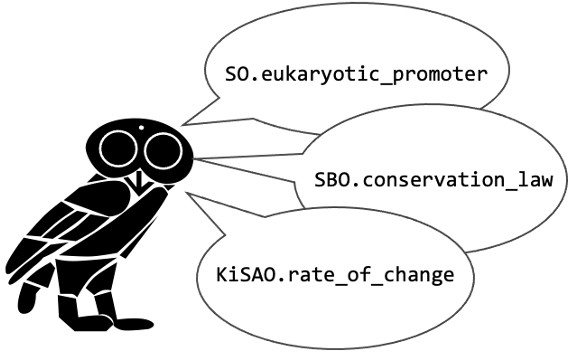

[](https://github.com/SynBioDex/tyto/actions)
[](https://tyto.readthedocs.io/en/latest/index.html)



# Tyto
**Take Your Terms from Ontologies (Tyto)** is a lightweight Python tool that makes the semantic web more user-friendly and accessible.

Tyto provides a handy interface for ontologies for use in your Python application. It automatically generates symbols for URIs based on the ontology terms themselves. Currently the following ontologies are supported out-of-the-box:

- Sequence Ontology (SO)
- Systems Biology Ontology (SBO)
- National Cancer Institute Thesaurus (NCIT)
- Ontology of Units and Measures (OM)
- NCBI Taxonomy (NCBITaxon)

For example:
```
>>> from tyto import SO, SBO
RDFLib Version: 5.0.0
>>> print(SO.promoter)
http://purl.obolibrary.org/obo/SO_0000167
>>> print(SBO.systems_biology_representation)
http://biomodels.net/SBO/SBO_0000000
```
These symbols are not hard-coded, rather they are dynamically generated by querying ontology lookup services on the web. Currently, the Ontobee and EBI Ontology Lookup Services are supported.  Additionally, an ontology can be imported from a local OWL file.

Since these ontology lookup services host hundreds of ontologies, Tyto does not currently ship with pre-defined interfaces to every ontology.  However, a new `Ontology` interface can be configured with minimal effort.  All of the heavy-lifting has already been implemented on the back-end. 
```
>>> from tyto import EBIOntologyLookupService, Ontology
>>> KISAO = Ontology(uri='http://www.biomodels.net/kisao/KISAO_FULL#', endpoints=[EBIOntologyLookupService])
>>> KISAO.Gillespie_direct_algorithm
'http://www.biomodels.net/kisao/KISAO#KISAO_0000029'
```

### Documentation

[Documentation on Readthedocs](https://tyto.readthedocs.io/en/latest/index.html)

### Inference and reasoning

Additionally Tyto supports reasoning and inference over ontology terms.  For example, the following evaluates to `True` because the Sequence Ontology categorizes an `inducible_promoter` as a specialized type of `promoter`. 
```
>>> tyto.SO.inducible_promoter.is_a(tyto.SO.promoter)
True
```
Other inference methods include:
```
term1.is_a(term2)
term1.is_descendant_of(term2)
term1.is_ancestor_of(term2)
term1.get_parents()
term1.get_children()
```

## About our mascot

_Tyto_ is the genus of birds to which owls belong, alluding to the Web Ontology Language (OWL) in which most ontologies are encoded. Tyto's logo is derived from the "Owl of Minerva" which is licensed under CC BY-SA 4.0.

## Acknowledgments

If you make use of Tyto, please cite:

>  Bryan A. Bartley, "Tyto: A Python Tool Enabling Better Annotation Practices for Synthetic Biology Data-Sharing", ACS Synthetic Biology, online February, 2022. DOI: 10.1021/acssynbio.1c00450 

Development of this library has been supported by the [DARPA Synergistic Discovery and Design (SD2)](https://www.darpa.mil/program/synergistic-discovery-and-design) program and [Raytheon BBN Technologies](http://bbn.com/).
